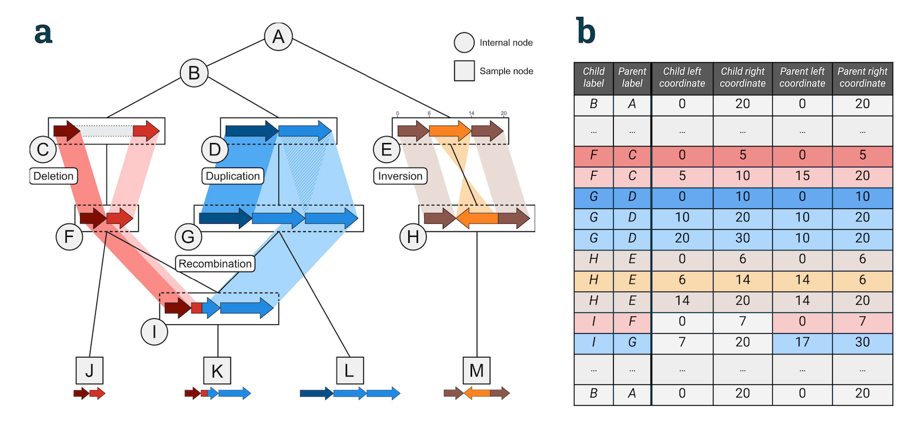

---
jupytext:
  text_representation:
    extension: .md
    format_name: myst
    format_version: 0.12
    jupytext_version: 1.9.1
kernelspec:
  display_name: Python 3
  language: python
  name: python3
---

(sec_concepts)=

# Concepts

Recombinant genealogies in the form of Ancestral Recombination Graphs (ARGs) can't
encode complex genomic rearrangements that generate structural variation (SV).
SV is increasingly seen as important both within and, especially, between species.

A (generalised) genetic inheritance graph (or GIG) extends the concept of an ARG
so that “edge annotations” can specify different parent and child left/right coordinates.
The resulting structure is comparable to an ARG, but is capable of representing
arbitrarily complex patterns of genetic inheritance. 

The Genetic Inheritance Graph Library (giglib) is a proof-of-concept implementation of the idea
behind GIGs, and is inspired by the standard [tskit](https://tskit.dev) ARG library.

## Details

In [`tskit`](https://tskit.dev) we use edge annotations to describe which pieces of DNA are inherited in terms of a left and right coordinate.
In giglib, this is extended to track the L & R in the edge *child*, and the L & R in the edge *parent* separately.
The left and right values in each case refer to the coordinate system of the child and parent respectively.

```{note}
For terminological clarity, we switch to using the term interval-edge (`iedge`)
to refer to what is normally called an `edge` in a *tskit* Tree Sequence.
Separating child from parent coordinates brings a host of extra complexities,
and it’s unclear if the efficiency of the tskit approach,
with its edge indexing etc, will port in any meaningful way to this new structure.
```

## Structural variation

Below are some examples of how different sorts of structural variation can be encoded. These correspond to the
schematic below:



### Inversions

The easiest example is an inversion. This would be an iedge like

```
{parent: P, child: C, child_left: 6, child_right: 14, parent_left: 14, parent_right: 6}
```

There is a subtle gotcha here, because intervals in a GIG, as in _tskit_, are treated as half-closed
(i.e. do not include the position given by the right coordinate). When we invert an interval, it
therefore does not include the *left* parent coordinate, but does include the *right* parent coordinate.
Any transformed position is thus out by one. Or to put it another way, an inversion specified
by child_left=0, child_right=3, parent_left=3, parent_right=0 transforms the points
0, 1, 2 to 2, 1, 0: although the *interval* 0, 3 is transformed to 0, 3., the *point* 0 is transformed
to position 2, not position 3. See
[here](https://github.com/hyanwong/giglib/issues/41#issuecomment-1858530867)
for more discussion.

### Duplications

A tandem duplication is represented by two iedges, one for each duplicated region:

```
{parent: P, child: C, child_left: 10, child_right: 20, parent_left: 10, parent_right: 20}
{parent: P, child: C, child_left: 20, child_right: 30, parent_left: 10, parent_right: 20}
```

Or one of the iedges could represent a non-adjacent duplication (e.g. corresponding to a transposable element):
```
{parent: P, child: C, child_left: 25, child_right: 35, parent_left: 10, parent_right: 20}
```

### Deletions

A deletion simply occurs when no material from the parent is transmitted to any of its children (and the coordinate system is shrunk)

```
# Deletion of parental region from 5-15
{parent: P, child: C, child_left: 0, child_right: 5, parent_left: 0, parent_right: 5}
{parent: P, child: C, child_left: 5, child_right: 10, parent_left: 15, parent_right: 20}
```

